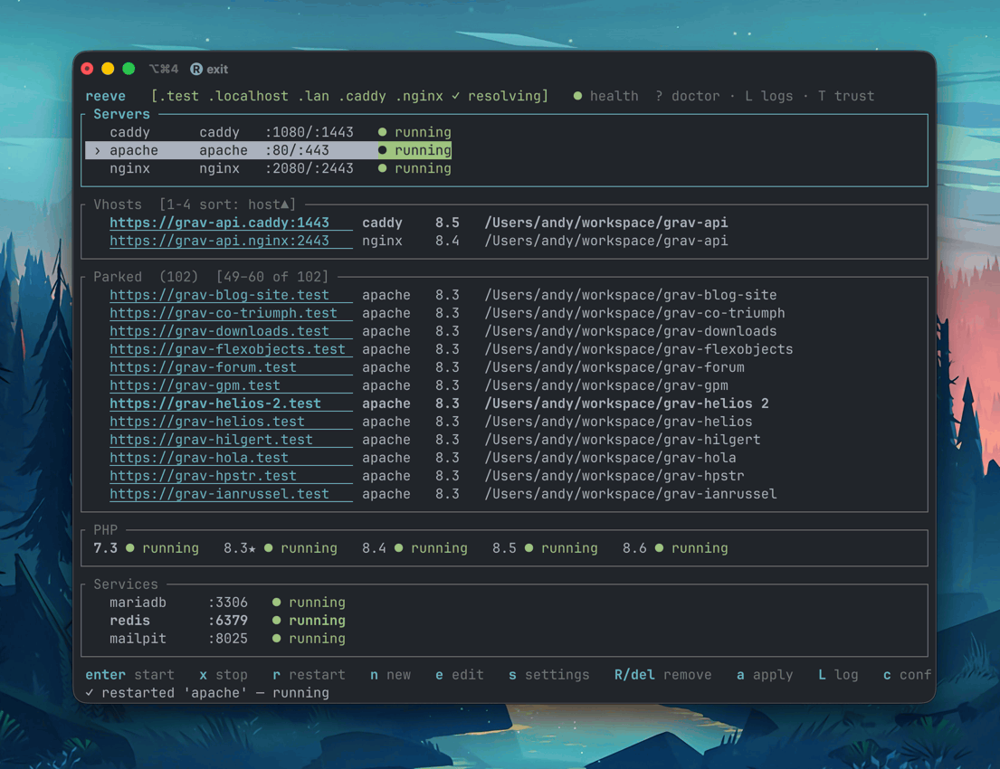

# reeve

```
 _ __ ___  _____   _____
| '__/ _ \/ _ \ \ / / _ \
| | |  __/  __/\ V /  __/
|_|  \___|\___| \_/ \___|
       RunCloud, scaled down — for localhost.
```

A local web development stack manager for macOS. Think RunCloud, scaled down,
localhost-only, open source: provision and manage web servers, **per-vhost PHP
versions**, SSL, and DNS — from one CLI and TUI.

Written in Rust. It does not bundle servers or PHP; it orchestrates
Homebrew-installed ones and manages them as your-user launchd services (no sudo).



## Why

The classic macOS + Homebrew + Apache + `mod_php` setup links exactly **one**
PHP version at a time. reeve drops `mod_php` for **PHP-FPM, one master per
version**, so two vhosts can run two different PHP versions *simultaneously* —
the thing the old switcher-script approach can't do.

## Highlights

- **Per-vhost PHP version** — each vhost picks its PHP; versions run side by side.
- **Multiple backends** behind one abstraction: **Caddy**, **Apache**, **nginx**
  (OpenLiteSpeed is wired but unsupported on macOS — see below).
- **Run several servers at once**, on different ports, managed independently.
- **Trusted local SSL** via a shared mkcert CA — `https://app.test` with no warnings.
- **Wildcard DNS** for one or more TLDs (`.test`, `.localhost`, `.lan`, …) via a
  user-run dnsmasq (no root daemon).
- **Default site** — optionally serve a catch-all from your sites root, so
  `http(s)://localhost` works without a per-project vhost.
- **TUI dashboard** with live status, plus a scriptable CLI — same engine underneath.
- **No sudo** for day-to-day use; servers bind 80/443 as your user via launchd.

## Requirements

- macOS (built and tested on macOS 26 "Tahoe", Apple Silicon)
- [Homebrew](https://brew.sh) — reeve will offer to install it if missing

## Installation

### Homebrew (recommended)

```bash
brew install yetidevworks/reeve/reeve
```

### From crates.io

```bash
cargo install reeve-cli
```

(The crate is published as `reeve-cli` because `reeve` is already taken on
crates.io; the installed binary is still `reeve`.)

### From source

```bash
git clone https://github.com/yetidevworks/reeve
cd reeve
cargo install --path crates/reeve
```

### Pre-built binaries

Download from [GitHub Releases](https://github.com/yetidevworks/reeve/releases).

## Quick start

```bash
reeve init                 # detect Homebrew, scaffold config/state
reeve php install 8.3      # install a PHP version + its FPM master
reeve php install 8.4      # ...and another, running at the same time
reeve server add caddy     # add a web server (default ports 80/443)
reeve vhost add app.test --root ~/Sites/app --php 8.3 --server caddy --ssl
reeve server start caddy   # render config, mint cert, start
```

One-time DNS + trust setup so `*.test` resolves system-wide and certs are trusted:

```bash
reeve dns setup            # installs dnsmasq + wires /etc/resolver (one admin prompt)
reeve ssl trust            # install the mkcert CA into your trust store (once)
```

`dns setup` writes the root-owned `/etc/resolver/<tld>` files itself via the
native macOS admin dialog — no manual `sudo` needed. In the TUI, press `D`.

Then `https://app.test` just works in the browser.

## TUI

Run with no arguments to open the dashboard:

```
reeve
```

```
 reeve   [.test ✓ resolving]
┌ Servers ─────────────────────────────────────────────┐
│ › caddy    caddy   :80/:443     ● running             │
│   apache   apache  :8080/:8543  ● running             │
│   nginx    nginx   :9090/:9443  ○ stopped             │
├ Vhosts ───────────────────────────────────────────────┤
│   https://app.test   caddy   8.3   ~/Sites/app        │
├ PHP ──────────────────────────────────────────────────┤
│ 8.3★ ● running    8.4 ● running                       │
└───────────────────────────────────────────────────────┘
 enter start · x stop · r restart · n new · e edit · s settings · q quit
```

Navigation is shared across panels; the key bar is context-aware (it shows the
keys for the focused panel).

| Key | Action |
|-----|--------|
| `↑` `↓` `←` `→` / `hjkl` | Move selection within the focused panel |
| `Tab` / `Shift-Tab` | Switch panel (Servers → Vhosts → PHP) |
| `n` | New — server / vhost / PHP install (per focused panel) |
| `e` | Edit — server (ports, backend, default site) / vhost / PHP extensions |
| `Enter` | Start server / restart FPM master |
| `x` · `r` | Stop · restart (Servers) |
| `s` | Per-backend settings (Servers) |
| `d` | Set default PHP version (PHP panel) |
| `Del` / `Backspace` | Remove the focused item (with confirm) |
| `a` · `v` | Apply · validate all configs |
| `c` | Preferences (TLDs, sites root, default backend) |
| `D` | Set up wildcard DNS (admin prompt) |
| `q` / `Esc` | Quit |

## Commands

| Command | Description |
| --- | --- |
| `init` | Detect Homebrew, scaffold config/state |
| `php install <ver>` | Install (or adopt) a PHP version + FPM master |
| `php list` / `php use <ver>` | List versions / set the default |
| `php ext add\|remove\|list <ver> [name]` | Manage extensions per version (pecl) |
| `server add <backend> [--http N --https N]` | Add caddy\|apache\|nginx |
| `server start\|stop\|restart\|list <name>` | Manage a server (independent) |
| `vhost add <host> --root <dir> --php <ver> --server <name> [--ssl]` | Add a vhost |
| `vhost list\|remove <host>` | Manage vhosts |
| `apply` | Render generated configs + reconcile running services |
| `validate` | Run every backend's native config test |
| `ssl mint <host>` / `ssl trust` / `ssl ca` | Local certificates |
| `dns setup` / `dns status` | Wildcard `*.test` DNS |

## How it works

`state.toml` is the single source of truth (servers, PHP versions, vhosts).
reeve **renders** native configs (Caddyfile, httpd vhosts, nginx server
blocks, FPM pools) into `generated/`, then reconciles launchd services to match.
You never hand-edit generated files — you edit state via the CLI/TUI and `apply`.

```
~/Library/Application Support/reeve/
  config.toml · state.toml · generated/ · certs/ · logs/
~/.reeve/run/            # sockets (kept space-free, short)
```

## OpenLiteSpeed

OLS has no official macOS build, and the only community Homebrew tap fails to
compile its (2022-deprecated) `admin_php` dependency against the current macOS
SDK. The backend is wired in and will activate if a working OLS install appears,
but it is **not usable on macOS today**. Use Caddy, Apache, or nginx.

## Development

```bash
cargo build              # debug build
cargo test               # unit tests
cargo clippy --all-targets -- -D warnings
cargo fmt --all
cargo install --path crates/reeve   # install the local binary
```

The repo is a Cargo workspace; the crate lives in `crates/reeve`. CI runs
fmt + clippy + tests on macOS and Linux; tagged `v*` pushes build release
binaries, publish `reeve-cli` to crates.io, and update the Homebrew tap.

## License

[MIT](LICENSE) © 2026 Andy Miller
